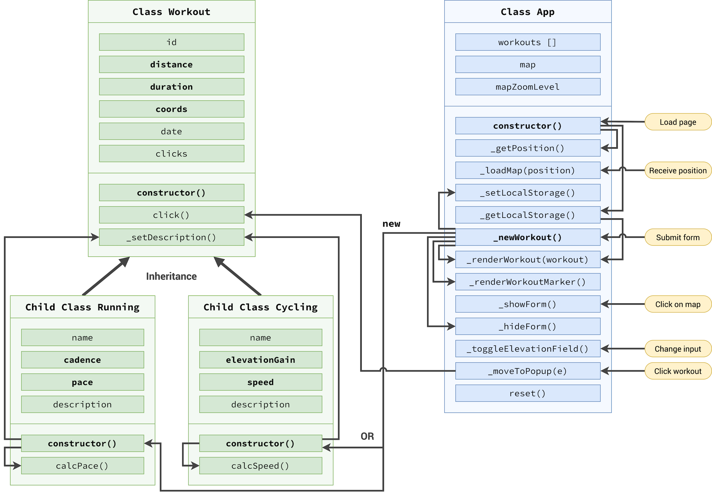

# Mapty - Map Your Workouts! 🏃‍♂️🚴‍♀️



Mapty is a vanilla JavaScript application that allows users to log their running and cycling workouts on a beautiful interactive map. It uses the Leaflet map library and the browser's Geolocation API to pinpoint your exact location.

## 🌟 Live Demo

[**View Live Demo on Vercel**](https://mapty-js.vercel.app/) *(Note: Update this link with your actual Vercel URL once deployed)*

[](https://vercel.com/new/clone?repository-url=https%3A%2F%2Fgithub.com%2FMahmoudMosTafa717%2FMapty-JS)

## ✨ Features

- **Geolocation**: Automatically centers the map on your current location.
- **Interactive Map**: Click anywhere on the map to add a new workout.
- **Workout Types**: Choose between Running (tracks cadence and pace) and Cycling (tracks elevation gain and speed).
- **Persistent Data**: Workouts are saved in your browser's Local Storage so they're always there when you come back.
- **Dynamic List**: View all your workouts in a list and click them to automatically pan the map to that specific workout location.
- **Object-Oriented Architecture**: Built using modern ES6 Classes for clean, maintainable, and structured code.

## 🚀 Built With

- HTML5 & CSS3
- Vanilla JavaScript (ES6+)
- [Leaflet.js](https://leafletjs.com/) (Open-source interactive maps)
- OpenStreetMap (Map tile provider)

## 🛠️ Local Setup

To run this project locally on your machine:

1. Clone this repository:
   ```bash
   git clone https://github.com/MahmoudMosTafa717/Mapty-JS.git
   ```
2. Open the project folder.
3. Simply open the `index.html` file in your preferred browser, or use a local development server like Live Server.
4. **Important**: Make sure to allow location permissions in your browser when prompted, otherwise the map won't load properly.

## 🏗️ Architecture

Mapty uses a fully Object-Oriented Architecture. 
- The `App` class handles the core application logic, rendering, event listeners, and local storage operations.
- The `Workout` class acts as the parent data class, with `Running` and `Cycling` inheriting from it to add their specific properties.

---

*This project was built as part of The Complete JavaScript Course by Jonas Schmedtmann.*
